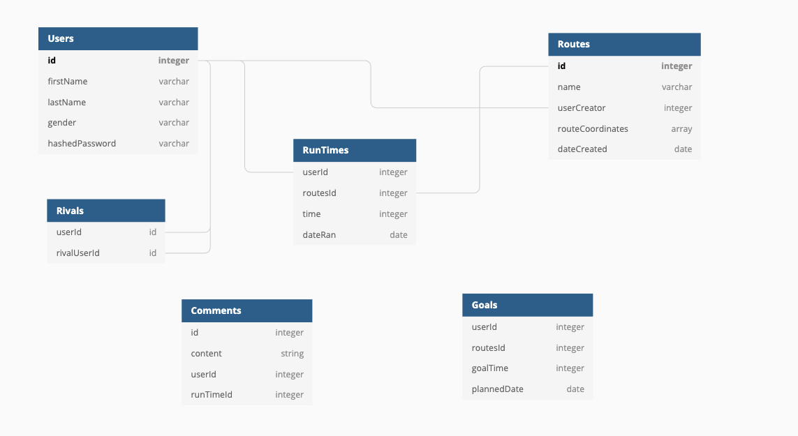

<h1 align='center'>Catch Me If You Can Documentation</h1>

Built with 
 

By
 
<a href='https://www.linkedin.com/in/aaron-hanson-brb/'>Aaron Hanson</a>
<a href='https://www.linkedin.com/in/kyle-barthelmes-a5120b51/'>Kyle Barthelmes </a>
<a href='https://www.linkedin.com/in/nicholas-richard-77a9a066/'>Nick Richard</a>
<a href='https://www.linkedin.com/in/rhysprevite/'>Rhys Previte</a>

 

<a href='https://catch-me-if-you-cann.herokuapp.com/'>Live Link</a>

## Summary
Catch Me If You Can is a fun, competitive app that lets you create and track routes that you've walked, biked or ran. Add friends ("rivals") and they can track their own times on your route. Each route has a leaderboard to see who has the fastest time!

## Features
### Interactive map using © MapBox api 
  - Create routes using markers for start and finish of a route
  - Search for beginning points of routes within a certain radius using the app's Find a Route feature

  

### Dashboard that tracks several key metrics
  - Most recent route's time to completion and distance
  - Total distance along routes
  - Total time on routes
  - Total calories burned
### Community page with the following features
  - Search for other users ("rivals") and add them to your community
  - See community members' profile and dashboard
### View all the personal routes you've added and view their leaderboards
 

## Database Schema

# Usage 

## Demo User
There is a **Demo** login that allows access to the site. However, the Demo User Login does **NOT** use your geolocation, but instead uses a hard-coded latitude and longitude. If you would like to see routes in your local area, either manually navigate to your region or sign up for the site to get instant data on your area.

## Contribution
If you would like to contribute to this project in any way, you may take the following steps
  1. Fork this repository
  2. Locally create a new branch `git checkout -b <new branch name>`
  3. Make updates and push branch up to repo `git push -u origin <new branch name>`
  4. Create a pull request
    - Please include clear details of changes 
  
  ### Reporting bugs
  Please report any bugs/issues you may find via opening an issue in this repo

  ## Development
  Follow these steps if you need guidance on setting up and running a local server for this project
  1. Clone or fork this repo
  2. **cd** into **backend** and run `pipenv install --dev -r dev-requirements.txt && pipenv install -r requirements.txt`
  3. **cd** into **frontend** and run `npm install`
  4. Create a **.env** file in both the **frontend** and **backend** and follow the **.env.example** files
  5. Create a postgresql database according to the `DATABASE_URL` in **.env.example**
  6. Start your Flask app from **backend** with `pipenv run flask run`
  7. Start your React app from **frontend** with `npm start`
  - Server will be on **http://localhost:3000/**

